# Dokumentacja projektowa 
 
### Aplikacja desktopowa umożliwiająca zamówienie kuriera w celu wysłania przesyłki. 
 
# Spis treści
1. [Opis projektu](#opis-projektu)
      - [Analiza wymagań funkcjonalnych](#analiza-wymagań-funkcjonalnych)
        - [Gość](#gość)
        - [Użytkownik](#użytkownik)
        - [Admin](#admin)      
2. [Diagramy UML](#diagramy-uml) 
	- [Diagram klas](#diagram-klas)
	- [Diagram przypadków użycia](#diagram-przypadków-użycia)
	- [Diagram aktywności](#diagram-aktywności)		
3. [Technologie](#technologie)
4. [Autorzy](#autorzy)
5. [Licencja](#licencja)

# Opis projektu
Aplikacja umożliwia zamówienie kuriera w celu wysłania przesyłki. Każdy gość uruchamiający naszą aplikację uzyskuje możliwość wyceny przesyłki bez rejestracji. Może przeglądać ranking kurierów, opinie na temat firm kurierskich oraz ranking ich popularności. Jeżeli gość zdecyduje się na skorzystanie z naszych usług najpierw musi zarejestrować się w naszym serwisie. Po rejestracji użytkownik może przejść do procesu zamówienia przesyłki. Składa się on z podania informacji o przesyłce, wyboru interesującego nas kuriera, podania danych nadawcy i odbiorcy oraz zatwierdzenia zamówienia. Zostanie wygenerowany dla niego raport pdf potwierdzający złożenie zamówienia. Dodatkowo po każdym złożonym zamówieniu klient otrzymuje punkty premium, które może wykorzystać w sklepie premium, w celu odebrania nagrody. Użytkownik może przeglądać wszystkie złożone przez niego zamówienia, oraz ocenić każde zamówienie w formie wystawienia opinii dla wybranej przez niego firmy kurierskiej. Jeżeli przesyłka nie została jeszcze wysłana ma możliwość anulowania zamówienia. Po zalogowaniu na konto admina możemy zarządzać serwisem zamawiania paczek m.in. zmieniać status zamówień, dodawać nowych kurierów do bazy, dodawać prezenty oraz modyfikować bazę danych. 
 
### Analiza wymagań funkcjonalnych
#### Gość
- Gość może utworzyć konto w aplikacji.
- Gość może przeglądać dostępnych kurierów oraz cennik.
- Gość może obliczyć cenę przesyłki.
- Gość może przeglądać ranking kurierów.
- Gość może przeglądać opinie dotyczące kurierów.
#### Użytkownik
- Użytkownik może tworzyć/edytować/aktualizować swoje dane adresowe.
- Użytkownik może zamówić kuriera, by nadać paczkę.
- Użytkownik może wybrać kuriera z listy kurierów.
- Użytkownik może wyświetlać swoje zamówienia.
- Użytkownik może anulować swoje zamówienie.
- Użytkownik może obliczyć koszty wysłania paczki.
- Użytkownik może wystawiać opinie po złożonym zamówieniu
- Użytkownik może zbierać punkty premium.
- Użytkownik może użyć punktów premium do odebrania prezentów.
- Użytkownik może wygenerować raport pdf po zrealizowaniu zamówienia.
#### Admin
- Admin może przeglądać statystyki realizowane w formie wykresów.
- Admin może zarządzać bazą danych:
    - Zmieniać status zamówienia,
    - Dodawać/edytować firmy kurierskie,
    - Dodawać prezenty za punkty premium.

### Diagramy UML
#### Diagram klas
 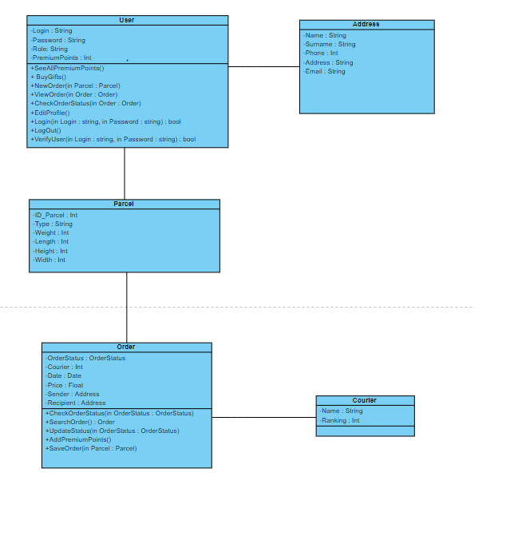  
#### Diagram przypadków użycia
 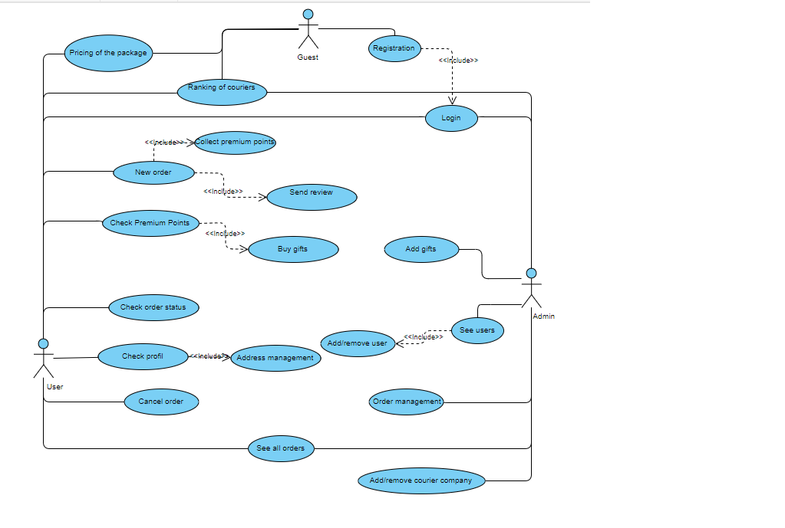  
#### Diagram aktywności
 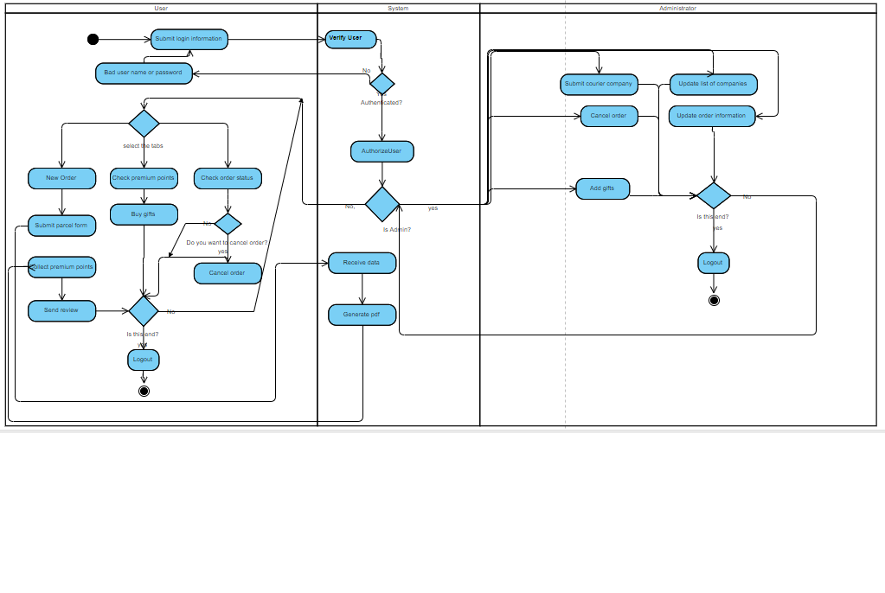  

### Technologie
1. JavaFX
2. Gradle
3. MySql

### Obsługa aplikacji
#### Domyślne dane logowania:
##### Administrator: admin123 admin123
##### Pracownik: worker123 worker123
##### Użytkownik: user123 user123
Po uruchomieniu aplikacji wyświetlone zostanie menu główne aplikacji.
 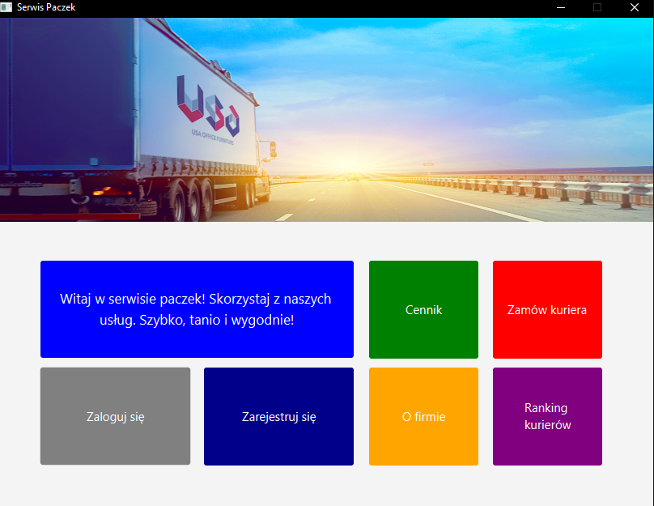  
Poprzez wciśnięcie przycisków możemy zobaczyć ranking oraz cennik kurierów i informacje o firmie.
 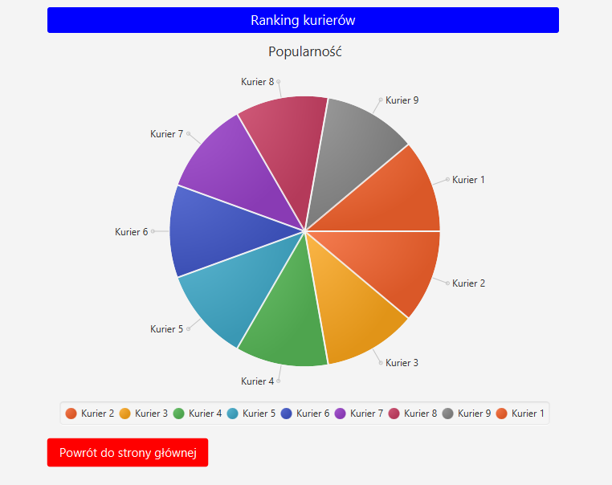  
 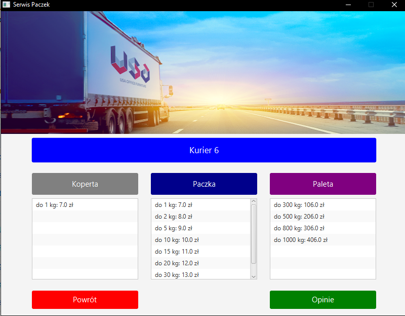  
Gość ma możliwość naciśnięcia guziku ,,zamów kuriera", wpisaniu danych przesyłki co doprowadzi do wyświetlenia listy dostępnych kurierów. Jeżeli będzie chciał wybrać kuriera by przejść dalej wyświetli się dialog informujący, że do przejścia dalej potrzebne jest zalogowanie.
 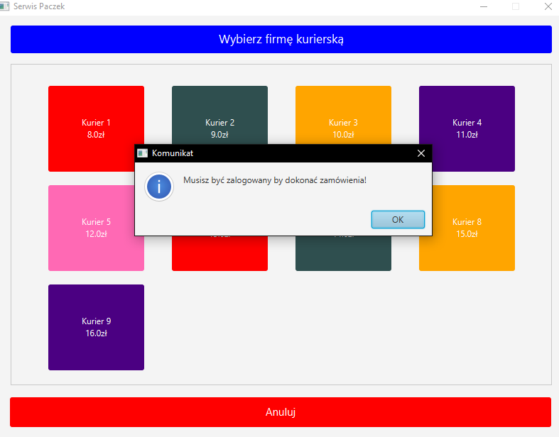  
Gość następnie ma możliwosc zarejestrowania się oraz zalogowania, wszystkie dane są poddane walidacji (testowy użytkownik - username Uzytkownik1, password - Uzytkownik1.
 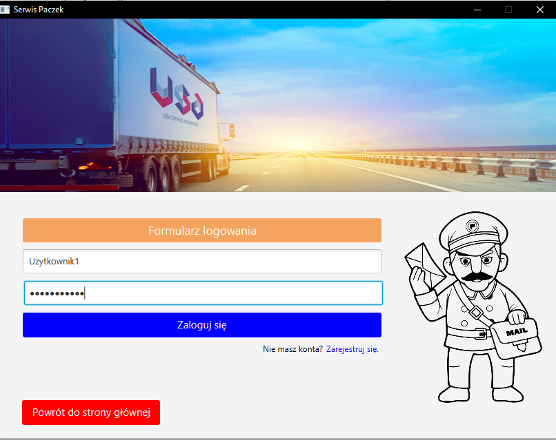  
Po zalogowaniu się, może przejść znowu do modułu zamówienia kuriera, jeżeli podczas wybrania kuriera nie posiada dostępnych środków na koncie, zostanie wyświetlona informacja informująca o tym. 

User w celu dokonania zamówienia doładowuje prowizorycznie swój portfel.
 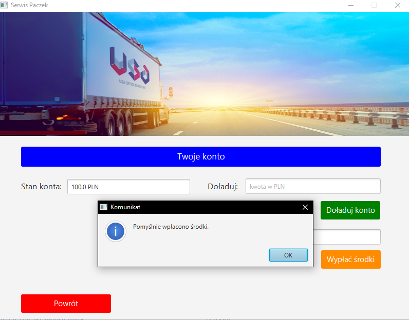  
Wybiera kuriera, jeżeli wszystko poprzednie zostało spełnione, przechodzi do okna w którym wypełnia swój adres oraz osoby, do której chce go wysłac. Jeżeli zalogowany użytkownik posiada wypełniony swój profil, może automatycznie wypełnic pola tekstowe. Jeżeli dane przejdą walidacje, pojawia się kończące okno. 
 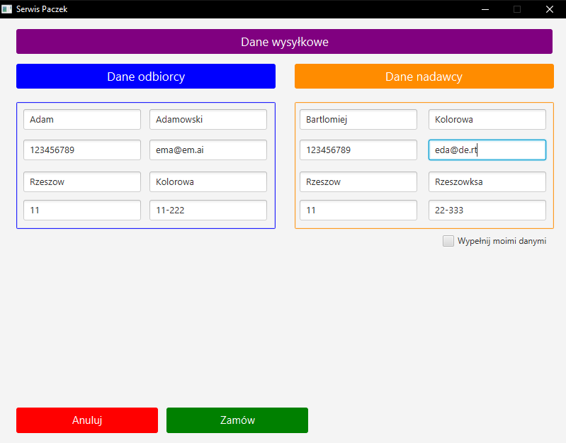  
W ostatnim oknie modułu zamówienia mamy możliwość wygenerowania PDF'a z informacjami o zamówieniu oraz o stanie konta.
 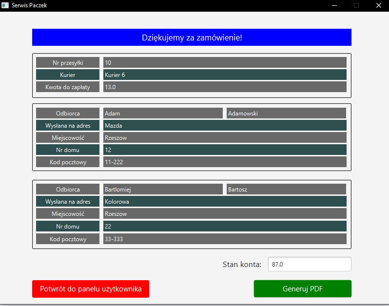  
Następnie pracownik może zalogować się (testowy pracownik - username - worker123 , password - worker123), wyświetlona zostanie menu pracownika. Może on zarządzać przesyłkami, zmieniać ich status oraz filtrować.
 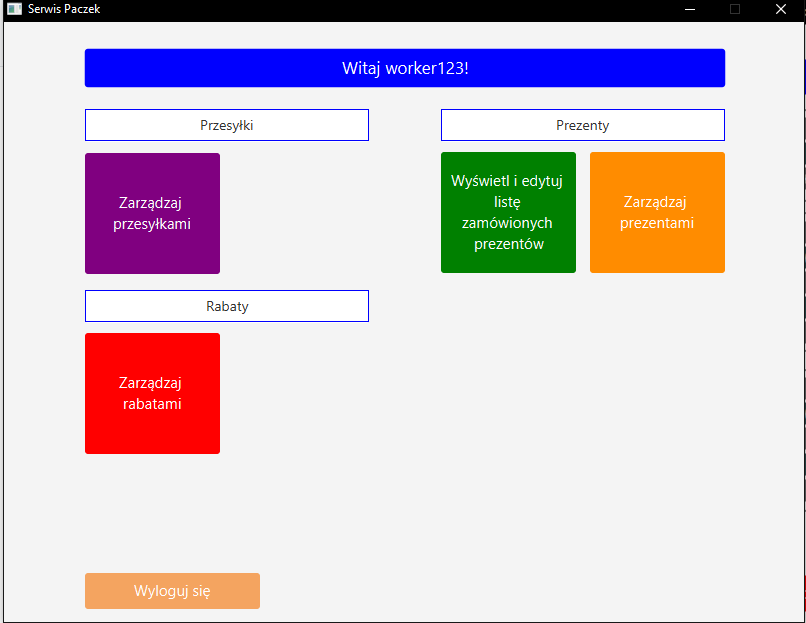  

Ma również możliwość dodawania zarządzania prezentami - wyświetlania, dodawania, edycji oraz usuwania. Następnie może wyświetlić liste zamówionych prezentów, zmienić ich status oraz filtrować - wszystkie dane podlegają walidacji

Admin (domyślne dane logowania - username - admin123, password - admin123) 
Admin może zarządzać w ten sam sposób zamówieniami. 
 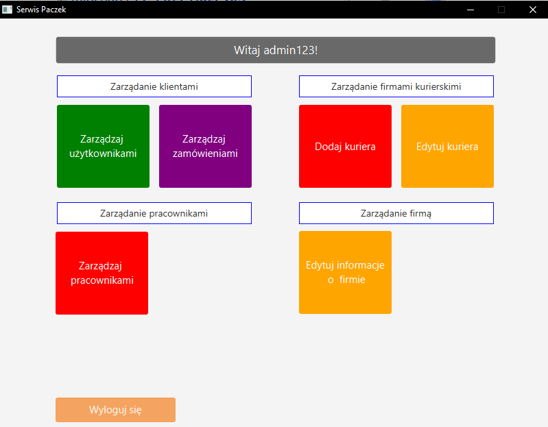  
 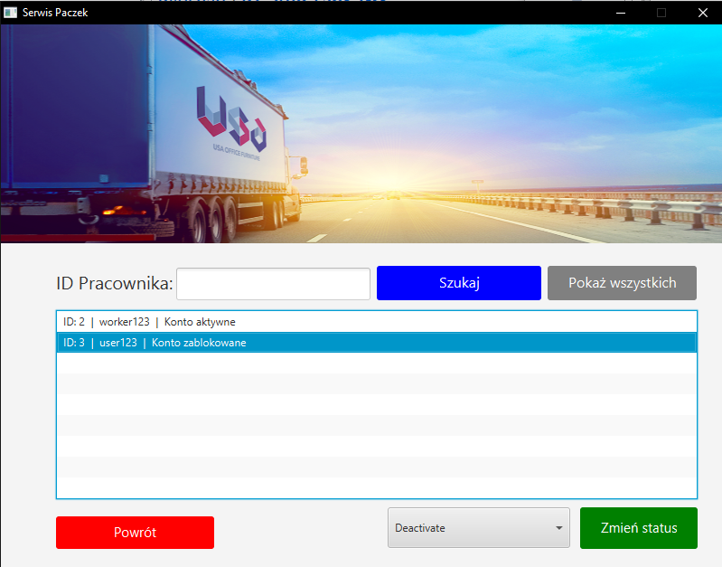  
Ma możliwość dodawania oraz edytowania kuriera, filtrowania ich  - wszystkie dane podlegają walidacji.

Następnie może ulepszać konto zwykłego użytkownika do roli pracownika poprzez zmienianie ich statusu.
Dodatkowo ma możliwość zmiany informacji o firmie 
Dodatkowo ma możliwość zarządzania rabatami - wyświetlania, dodawania nowych, edycji oraz usuwania - wszystkie dane podlegają walidacji
### Autorzy
- Paweł Fiołek
- Patryk Brzuchacz
- Alan Biały
- Klaudia Cyran
- Krzysztof Duda
### Licencja
Aplikacją jest objęta licencją MIT.

